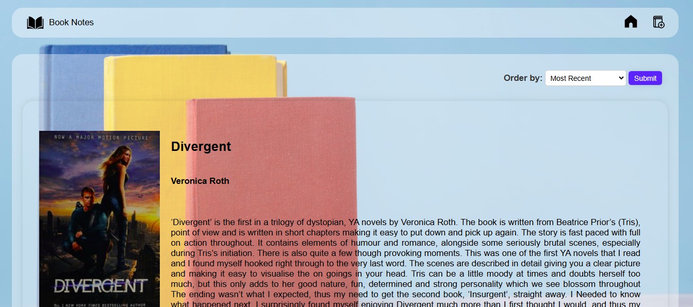

# Book Notes App


## A web app to add and manage personal book notes using Node.js, Express, and EJS.

### ✨ Features

- Books can be sorted by the user.
- Add entries based on title and author.
- Include personal rating and review.
- Delete a book (requires password to confirm).

---

### 🚀 Usage

- Visit: `http://localhost:3000`
- Sort the books as needed.
- Click "Add Note" to create a new book note.
- Use "Edit" to update an existing note.

---

### ⚙️ Installation

1. Clone the repo
   ```bash
    git clone https://github.com/jesselouiselat/book-notes.git
   ```
2. Go into the folder
   ```bash
   cd book-notes
   ```
3. Install the dependencies

   ```bash
   npm install
   ```

4. Run the app
   ```bash
   npm start
   ```

---

## Screenshots




---
